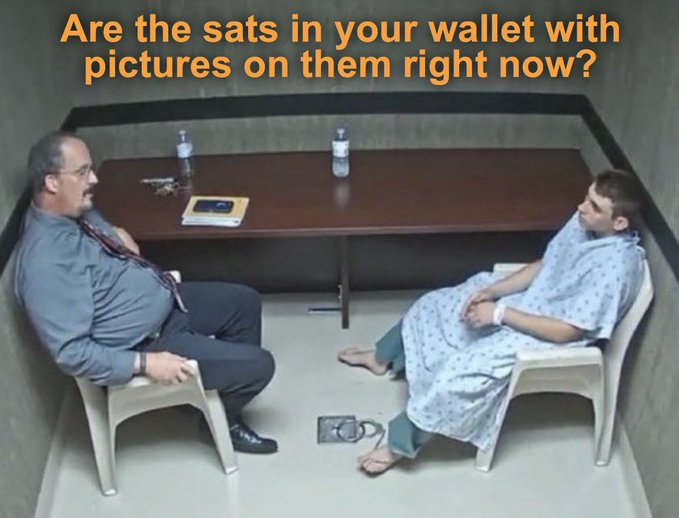

Ordgen / ORC-721

#  Frequently Asked Questions  (F.A.Q) and Answers

## Q: Wen image (in wallet) - i see text?

No worries ... all generative metadata is "on-chain" and the spritesheets and recursive building blocks.

tip:  if anyone feels like they don't own the image because only the image DNA or formula (AND yes, all "recursions" or "spritesheets")  to generate is "on-chain" and inscribed forever ... than you can generate the image "off-chain" in any size e.g. 1x, 4x, 8x, 10x, 20x as .PNG
or even as .SVG .... and than inscribe the image.

note: ordgen / ORC-721 are generatives, that is, YOUR NUMBERS - YOUR IMAGE.

... still worried - you are not alone - see this meme:

fyi -  if your plain image e.g. .SVG or .PNG or .JPEG is "on-chain" than it is ONLY accessible via complex segwit bitcoin decoding / data generation  ... the data is stored in the bitcoin segwit store with OP_IF / OP_ELSE envelopes or such ... that is, more cryptic than the ordgen / ORC-721 text protocol.

## Q:  Does Magic Eden (ME) or Ordinals Wallet.com (OW) support Ordgen / ORC-721? Will the images be on the market?

nobody supports ordgen / ORC-721 image generation (yet)...   Ordinal Wallets.com (OW) supports "off-chain" images - same as Magic Eden (ME) in inscriptions.json with  high_res_img_url key.

Yes, the reference inscriptions.json (for market submit)
includes the `high_res_img_url` key
(with public image hosted @ [ordbase.github.io](https://ordbase.github.io/)
or on your own host).

## Q:  How can i generate the  image "off-chain"?

The ordgen image generation algorithm is "super-simple" ... paste / merge the generative sprites / tiles / "recursions" 
in the stacking order (left-to-right) into a new image (using the dim size from deploy text eg. 24x24, 32x32 etc). That's it.  

Use any programming or scriptiong language of your choice. Or use the ready-made ordgen library (or tooling).

For ready-made preview scripts, see [/preview »](preview).

For ready-made generate scripts, see [/generate »](generate).

## Q:  YOUR NUMBERS, YOUR IMAGE - explain?

Your image is a computer-generated image (CGI) or generative.
You  are the creator and you own the computer-generated image,
that is the idea / rule of "YOUR NUMBERS, YOUR IMAGE".

## Q:  Wen "on-chain" image renderer in javascript (.js) inscribed?

The javascript (.js) renderer to generate images with "on-chain" data only
is planned from day one. SOON!

## Q: Is Ordgen / ORC-721 recursive?

Yes, ordgen / ORC-721 is recursive generative. The world
is not recursive vs generative.
Recursive gives generative new super-powers. It's 2+2 is 4.

Before the ord recursive update v0.6 - ordgen was "recursing"
on its own spritesheets only ... now with the ord recursive update
ordgen can "recurse" on its own spritsheets AND on all inscriptions (recursive or not). Mix'n'match ("recurse") building blocks / sprites / tiles  that's the idea from the beginning in ordgen / ORC-721.

Note: Ordgen / ORC-721 is a (text) protocol meaning
the generative metadata is "on-chain" and the spritesheets and recursive building blocks.

The image generation (or viewer / browser) is possible "on-chain"
with javascript (.js) renderers
but "off-chain" is prefered because upgradable day-to-day, month-to-month, year-to-year ... offering ever more functionality (and bug fixes).

## Q:  The ordgen image is a text inscription? Can a text inscription be recursive?

what is recursive? let's have fun with this Magic Eden (ME) statement / reasoning:

> The [100 D.I.Y. Martians] inscriptions do not look recursive (they are text).

Text? Text? Text?!

From the wikipedia article on SVG:

> SVG images are defined in a vector graphics format and stored in ......
>

drum-roll please ....

>  text files.

It's still early. Anyone wants to do HTML ...    web pages defined in a markup format and stored in ....  You tell us.    It's still early.

## Q: Wen (scalable) vector graphics (.SVG) in ordgen?

SOON!
See [Quick Notes & Commentary on (Scalable) Vector Graphics (.SVG) »](SVG.md)

## Collections

## Q: Is the D.I.Y Martians Art itself a copy of an existing collection?

that's a good one.  first these are creator's do-it-yourself (DIY) original inscribes AND  it's recursive!  many originals inscribed first-time e.g. 10 boring backgrounds, 7 martians, martian happy smile, laser eyes, etc.  AND recursive (reuse) inscribes - from recursive punk collection and recursive noun punks.  tell again D.I.Y Martians is not recurisve ;-).

# Questions? Comments?

Post them over at the [Help & Support](https://github.com/geraldb/help) page. Thanks.

