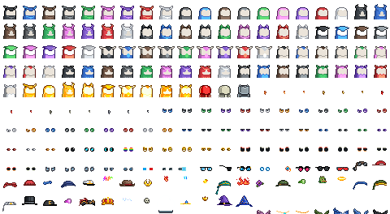

**Wen Market? Wen Magic Eden (ME)? Wen Ordinals Wallet (OW)?  See [/market @ Bitcoin Ordinal Generative (ORC-721 / OG / Ordgen) Community »](https://github.com/orc721/market)**


## What's News? Updates

We are live!  The world's first ORC-721 collections (on bitcoin) include:

[**721 D.I.Y. Punks**](https://ordinals.com/inscription/753f663770d816f61acd35da8dd04e122eec8582e93ca36b2122f2d4ac206089i0) (24×24px) - sub 10 million club!  - deploy (& spritesheet) inscribes thanks to [@ZimmerAllDay](https://twitter.com/zimmerallday)

<details>
<summary markdown="1">Show / Hide</summary>


</details>


[**721 D.I.Y. Punks V2**](https://ordinals.com/inscription/49fc0b24a6d2be8c78b1b468b77729e3516fae223766e64dc3e68d4051c52e89i0) (24×24px)


<details>
<summary markdown="1">Show / Hide</summary>


</details>


[**1000 D.I.Y. Ordibots**](https://ordinals.com/inscription/e1be0a2827e42ffaacde0da19006566d9efb5b920e41d29fd59b5d0a3527cfc8i0) (32×32px)

<details>
<summary markdown="1">Show / Hide</summary>


</details>


[**999 D.I.Y. Ordibots V2**](https://ordinals.com/inscription/671293d418f7e05a503ffec6703b266ce08eb5522329774f2ac008b883a4e2a0i0) (32×32px)

<details>
<summary markdown="1">Show / Hide</summary>


</details>


[**721 D.I.Y. Cool Cats**](https://ordinals.com/inscription/02ef2b3c240e56acd9ffad6c17e9758b5c5fd2d957fb80949f22de8c5ec6df83i0) (24×24px)   - deploy (& spritesheet) inscribes thanks to [@TheInscriptor](https://twitter.com/TheInscriptor)

<details>
<summary markdown="1">Show / Hide</summary>


</details>


[**1000 Words on Bitcoin**](https://ordinals.com/inscription/ac685db241919af1e5556bfc5a452e40efc961b074d385de750863256272a8aai0) (102×32px) by  [@ZimmerAllDay](https://twitter.com/zimmerallday) -
see the [Words On Bitcoin Getting Started Guide and Documentation »](https://github.com/ZimmerAllDay/btcwords)


[**721 D.I.Y. Birdies**](https://ordinals.com/inscription/5cf5cb5cf764f6363e6485b85824909533b8d274c4a9988a9c7362e3d4e4409fi0) (24×24px)  -  deploy (& spritesheet) inscribes thanks to [@TheInscriptor](https://twitter.com/TheInscriptor), public domain ("do what you want") pixel art thanks to [@TheSkullCat](https://twitter.com/TheSkullCat)


**ORC-721 Protocol Update - Look Ma! No Spritesheet! It's "Recursive!"**


[**100 D.I.Y. (Recursive) Apes**](https://ordinals.com/inscription/610ad953a48ce514ca71933b40228a366ef5edb8f6581ac20dca3098d618c7b2i0) (24×24px)   - world's 1st recursive generative  (re-using recursive punk .PNG inscribes in 24×24px - thank you!)

<details>
<summary markdown="1">Show / Hide</summary>


</details>


[**100 D.I.Y. (Recursive) Aliens**](https://ordinals.com/inscription/3832d5d8dc247cfa3506343acca1f4a9f1a9f914a4e6f16589e0dac4fdb67c1ci0) (24×24px)  - world's 2nd recursive generative  (re-using recursive punk .PNG inscribes in 24×24px - thank you!)


<details>
<summary markdown="1">Show / Hide</summary>


</details>


[**100 D.I.Y. (Recursive) Martians - Aliens Vol. 2**](https://ordinals.com/inscription/b2426c302ad2807d832b994cb509000a5fa8ac9c08cce273b16400a8409b4c13i0) (24×24px)  - world's 1st recursive generative mix'n'match  (re-using recursive punks, recursive noun punks, 10 boring backgrounds, 7 martians, alien happy smile 1/1, and more .PNG inscribes in 24×24px - thank you!) -  deploy (& 10 boring backgrounds, 7 martians, alien happy smile 1/1, & more) inscribes thanks to [@612crypto_eth](https://twitter.com/612crypto_eth)


<details>
<summary markdown="1">Show / Hide</summary>


... let's remove boring backgrounds ...


</details>


[**100 Orange Pixels**](https://ordinals.com/inscription/429915c362dacc2b1f7d4a5f7d929ee04e52298c35a7fe9c4e5a29580691b364i0) (24×24px) by  [@ZimmerAllDay](https://twitter.com/zimmerallday) -
see the [Orange Pixels Getting Started Guide and Documentation »](https://github.com/ZimmerAllDay/orangepixels)


**ORC-721 Protocol Update - Look Ma! No More Quotes (`"""`)! No More Commas (`,,,`)! No More Arrays (`[[[]]]`)! No More Objects (`{}`)!  No More JSON! It's Text!**


[**100 D.I.Y. (Left-Looking) Phunks**](https://ordinals.com/inscription/09e3c57879b0a30239b088468277d009f838111d254eb22f35a9b2a31b77a5d4i0) (24×24px)  - world's 1st generative with og standard text deploy & mint format; deploy (& spritesheet) inscribes thanks to [@AlteredOracle](https://twitter.com/AlteredOracle)


Wen [next] deploy?   You are welcome to announce your ORC-721 collections
in the [ordinal punks](https://ordinalpunks.com) discord (in the #generatie-orc-721 channel)
or in the [ordinal phunks](https://twitter.com/OrdinalPhunksV0) discord (in the #random / General channel).


## D.I.Y. GENESIS PUNKS (MAX. 10 000) NEED YOUR HELP


Yes, you can help! Looking for inscribe sponsor to get the free mint (first-come/first-serve) started  ...

The idea is re(use) or "recurse on" all 133 .PNG inscriptions in
the recursive punks collection - 
that are - surprise, suprise -  pixel-perfect copies of 
the "originals" in the CryptoPunksData contract (Anno 2021).

Let's deploy a new ordgen / ORC-721 collection - 10 000 D.I.Y. Genesis Punks - (re)using or (is it "recursing on"?) the .PNGs indexed 1 to 133 with the bonus bitcoin orange background at 0 - plus going beyond recursive punks 
by matching the attribute ids in the CryptoPunksData in the generative dna ("on-chain" bitcoin metadata).

... read more at the [10 000 D.I.Y. Genesis Punks Readme »](genesis)


PS:  Try the [D.I.Y. Genesis Punks (Image) Previewer »](https://ordbase.github.io/generative-orc-721/genesis)


<!--

## D.I.Y. PHUNKS (MAX. 99) NEED YOUR HELP

PHREE THE PHUNKS!

... let's kick-off 99 D.I.Y. (Left-Looking) Phunks this weekend ...


if anyone is interested in the upcoming free mint (first-come / first-serve),
please join the Ordinal Phunks discord ....
 for now find news & updates  in the #random (General) channel

Note: this is a world's 1st ORC-721 collection ... first with the new og standard text protocol ...
making minting easier (goodbye json, goodbye quotes (`"""`), goodbye commas (`,,,,`), goodbye objects (`{}`)
and so on (and less bytes saving sats).

Yes, you can help! Looking for inscribe sponsors to get started minting this weekend ...
for news & updates join  the Ordinal Phunks discord ..

Ordinal Phunks - what!? For more and discord invite see [**Ordinal Phunks »**](https://twitter.com/OrdinalPhunksV0)

Yes,  do not fade the Ordinal Phunks ... Ordinal Phunks are not going away ... and now get 99 D.I.Y. (Left-Looking) Phunks frens  ...
join us to make it happen.

... read more at the [99 D.I.Y. Phunks Readme »](diyphunks)


PS:  Try the [D.I.Y. Phunks (Image) Previewer »](https://ordbase.github.io/generative-orc-721/diyphunks)

-->


<!--


## D.I.Y. RECURSIVE MARTIANS - ALIENS VOL.2 (MAX. 100) NEED YOUR HELP ...


The idea ...

let's do the world's 1st (d.i.y) recursive generative ...
that let's you mix'n'match inscribes from more than one collection source (yes, that is recursive!) ...

**Wen deploy?**

Yes, you can help ...

**Step 1:  24×24px .PNG Inscribes - New Aliens, Laser Eyes & Backgrounds To "Recurse"**

Help with the 24×24px .PNG inscribes ...

**7 Martians in 24×24px in .PNG**


orange ->   <- (204 bytes)   [inscribe №12225771](https://www.ord.io/12225771)  by  [@612crypto_eth](https://twitter.com/612crypto_eth) - thank you!<br>
gold       ->     <-  (204 bytes)  [inscribe №12225872](https://www.ord.io/12225872)  by [@612crypto_eth](https://twitter.com/612crypto_eth) - thank you!<br>
cyber green  ->    <-  (207 bytes)  [inscribe №12225773](https://www.ord.io/12225773) by  [@612crypto_eth](https://twitter.com/612crypto_eth) - thank you!<br>
deep blue   ->     <- (207 bytes)    [inscribe №12225772](https://www.ord.io/12225772) by  [@612crypto_eth](https://twitter.com/612crypto_eth) - thank you!<br>
midnight   ->      <- (204 bytes)  [inscribe №12225841](https://www.ord.io/12225841) by [@612crypto_eth](https://twitter.com/612crypto_eth) - thank you!<br>
magenta    ->      <- (204 bytes)   [inscribe №12225843](https://www.ord.io/12225843)    by  [@612crypto_eth](https://twitter.com/612crypto_eth) - thank you!<br>
mars red ->   <- (204 bytes)   [inscribe №12225816](https://www.ord.io/12225816) by [@612crypto_eth](https://twitter.com/612crypto_eth) - thank you!


in 4x   (only for documentation - DO NOT INSCRIBE) <br>


... read more at the [100 D.I.Y. Recursive Martians (Aliens Vol. 2) Readme »](diymartians)

... your comments more than welcome on the new d.i.y. recursive martians<br>
... and again the call for help ...... if anyone wants to sponsor / lead / help with the inscribes (step one - the .PNGs in 24×24px - about 200 bytes each and step two - the deploy inscribe with a reference to the .PNG inscripton ids PLUS 20+ more "on-chain" thanks to recursive punks, please tell in the ordinal punks discord (in the #generative-orc-721 channel) - you make it all happen ...

Try the [D.I.Y. Recursive Martians - Aliens Vol. 2 Previewer »](https://ordbase.github.io/generative-orc-721/diymartians)


## D.I.Y. BIRDIES (MAX. 721) NEED YOUR HELP ...

... let's start minting the Week 02 - D.I.Y. Birdies (max. 721)  if possible ... <br>
... the spritesheet.png is ready to inscribe and has 200+ tiles (20 columns x 11 rows = 220 tiles / sprites)  ... it's about 35kb  ... <br>
... see



... your comments more than welcome on the new Week 02 - D.I.Y. Birdies collection - the structure - see [diybirdies/meta.csv](diybirdies/meta.csv) for details - is - bodies first incl. golden and skeleton (bone/ruby) and robot - the beak ("nose") -  eyes - and optional eyewear, headwear, and clothing - that's it.<br>
... and again the call for help ...... if anyone wants to sponsor / lead the inscribe (step one - the spritesheet and step two - the deploy inscribe with a reference to the spritesheet inscripton id, please tell in the ordinal punks discord (in the #generative-orc-721 channel) - you make it all happen ...

Try the [D.I.Y. Birdie Previewer »](https://ordbase.github.io/generative-orc-721/diybirdies)

-->


NEW!  For up-to-date ORC-721 analytics / statistics see the [Generative-ORC-721 Dune dashboard](https://dune.com/jokie/orc-721-dashboard)  - thanks to  [@ondograph11 (Jokie)](https://twitter.com/ondograph11).


---


# Generative ORC-721 Protocol / Standard for Bitcoin & Co.   (Also Known As OG, Ordgen, Ordinal Generative)

Author:  [Gerald Bauer](https://github.com/geraldb) ([Punk's Not Dead](https://github.com/cryptopunksnotdead), [Learn Pixel Art](https://github.com/learnpixelart), etc)


Let's deploy a new 100 d.i.y. phunk (pixel head) collection
in 8 seconds ;-) - yes, you can. Example - [Inscription No. 13418851](https://ordinals.com/inscription/09e3c57879b0a30239b088468277d009f838111d254eb22f35a9b2a31b77a5d4i0):

... in the standard text format:

```
og deploy diyphunks
name: D.I.Y. Phunks
max: 100
dim: 24x24
dd91c8b33dd19ccd8410e54c2099bfd50d4f777a186ee974fe4c15420c42ea0fi0
```

<details>
<summary markdown="1">Classic JSON Format</summary>

``` json
{
    "p": "orc-721",
    "op": "deploy",
    "slug": "diyphunks",
    "name": "D.I.Y. Phunks",
    "max": 100,
    "dim": "24x24",
    "generative": "dd91c8b33dd19ccd8410e54c2099bfd50d4f777a186ee974fe4c15420c42ea0fi0"
}
```

</details>


That's it. Ready to mint the first d.i.y. phunk with the (generative) specs - `0`:

- 0 -  phunk (human) base

in standard text format:

```
og mint diyphunks 0
```

<details>
<summary markdown="1">Classic JSON Format</summary>

``` json
{
   "p":"orc-721",
   "op":"mint",
   "s":"diyphunks",
   "g":[0]
}
```

</details>

  4x


and the second with the (generative) specs - `0 38`:

- 0 -   punk (human) base
- 38 -  laser eyes

in standard text format:

```
og mint diyphunks 0 38
```

<details>
<summary markdown="1">Classic JSON Format</summary>

``` json
{
   "p":"orc-721",
   "op":"mint",
   "s":"diyphunks",
   "g":[0,38]
}
```

</details>

  4x


and the third with the (generative specs) - `59 0 38`:

- 59 -   background - bitcoin pattern
- 0 -   punk (human) base
- 38 -  laser eyes


in standard text format:

```
og mint diyphunks 59 0 38
```

<details>
<summary markdown="1">Classic JSON Format</summary>

``` json
{
   "p":"orc-721",
   "op":"mint",
   "s":"diyphunks",
   "g":[59,0,38]
}
```

</details>

  4x


and so on.


NEW!  Try the [D.I.Y. Phunks Previewer »](https://ordbase.github.io/generative-orc-721/diyphunks)


Where's the catch?   Step 0: To make  it work you can (re)use
existing inscribed spritesheets / art layers or inscribe your very own.
Read on.


## Spritesheet / Artwork Layers Inscriptions

To inscribe your spritsheets / art layers you have
two format options:

1) binary images "standalone"
2) binary images packed up in a "spritesheet" - ultra-compact (less bytes, saving sats!)


NOTE:  Yes, support for more formats upcoming - next stop - vector graphics (in .SVG).


Let's use the d.i.y (left-looking) phunks as an example.


### Format Option 1) Binary Image - Ultra-Compact

Inscribe the spritesheet / art layers as a single binary image file (image/png).

Example - [spritesheet.png (~4kb) @ Inscription No. 13412985](https://ordinals.com/inscription/dd91c8b33dd19ccd8410e54c2099bfd50d4f777a186ee974fe4c15420c42ea0fi0):


<details>
<summary markdown="1">4x</summary>


</details>


Note:  To make it work all sprites or attributes MUST be of the same image dimension (e.g. 24x24) and get referenced by number (starting with 0)
counting left-to-right and top-to-bottom.


Thus, for example `59 0 38` from the mint starter examples
in standard text format:

```
og mint diyphunks 59 0 38
```

<details>
<summary markdown="1">Classic JSON Format</summary>

``` json
{
   "p":"orc-721",
   "op":"mint",
   "s":"diyphunks",
   "g":[59,0,38]
}
```

</details>


references the sprites / attributes no. 59 - ,
no. 0 - ,
no. 38- 
and the sprites / attributes
get merged / stacked / pasted-on-top-of-each-other in the order listed resulting in .


Aside - Pasted On Top Of Each Other?!

Yes, the (generative) magic is the transparent background / color!
If you merge a solid / fully opaque image (let's say all black)
on-top-of another image, than it gets completly overwritten -
to make the (generative) magic work - use the transparent color
in your sprite / art layers.


## Deploy Inscriptions


## Mint Inscriptions


## Sample Collections

### Sample No. 1 - D.I.Y. Orange-Pilled Punks (w/ Laser Eyes Optional)

**Format Option 1) Binary Image - Ultra-Compact**

Example - [diypunks/spritesheet.png](diypunks/spritesheet.png) (~4kb):


<details>
<summary markdown="1">4x</summary>


</details>

and the deploy inscription:

```
og deploy diypunks
name: D.I.Y. Punks
max: 721
dim: 24x24
cf5df319bbe23fa3d012e5ee0810700c8e82aebff41164246f0d87d7b60a9903i0
```

<details>
<summary markdown="1">Classic JSON Format</summary>

``` json
{
    "p": "orc-721",
    "op": "deploy",
    "slug": "diypunks",
    "name": "D.I.Y. Punks",
    "max": 721,
    "dim": "24x24",
    "generative": "cf5df319bbe23fa3d012e5ee0810700c8e82aebff41164246f0d87d7b60a9903i0"
}
```

</details>


and the mint inscriptions...


Try the [D.I.Y. Punks Previewer »](https://ordbase.github.io/generative-orc-721/diypunks)


To learn more or read-up on the D.I.Y. Punks OG & V2
inscribed on bitcoin (btc), see [D.I.Y. Punks Read Me 'n' Frequently Asked Questions (F.A.Q.s) & Answers »](diypunks)


### Sample No. 2 - D.I.Y. Wiener - Edmund "Mundl" Sackbauer et al  (SOON!)


**Format Option 1) Binary Image - Ultra-Compact**

Example - no2/spritesheet.png (~??kb):


<details>
<summary markdown="1">4x</summary>


</details>

and the deploy inscription:

```
og deploy diywiener
name: D.I.Y. Wiener
max: 100
dim: 32x32
<spritesheet/art layers inscription id here>
```

<details>
<summary markdown="1">Classic JSON Format</summary>


``` json
{
    "p": "orc-721",
    "op": "deploy",
    "slug": "diywiener",
    "name": "D.I.Y. Wiener",
    "max": 100,
    "dim": "32x32",
    "generative": "<spritesheet/art layers inscription id here>"
}
```

</details>


and the mint inscriptions...


### Sample No. 3 - D.I.Y. Ordibots

What's different compared to Generative BRC-721 (by Jerry Fanelli)?
Let's compare the Ordibots (BRC-721)
and D.I.Y. Ordibots (ORC-721) inscriptions!


**Format Option 1) Binary Image - Ultra-Compact**


Example - [diyordibots/spritesheet.png](diyordibots/spritesheet.png) (~3kb):


<details>
<summary markdown="1">4x</summary>


</details>


and the deploy inscription:


```
og deploy diyordibots
name: D.I.Y. Ordibots
max: 1000
dim: 32x32
<spritesheet/art layers inscription id here>
```

<details>
<summary markdown="1">Classic JSON Format</summary>

``` json
{
    "p": "orc-721",
    "op": "deploy",
    "slug": "diyordibots",
    "name": "D.I.Y. Ordibots",
    "max": 1000,
    "dim": "32x32",
    "generative": "<spritesheet/art layers inscription id here>"
}
```

</details>


and the mint inscriptions:

ordibot no. 0 specs:
- background:  2 - brown
- accessories:  5 - none
- body:    16 - standard-oval
- belly:   23 - empty
- face:   9 - surprised


```
og mint diyordibots 2 5 16 23 9
```

<details>
<summary markdown="1">Classic JSON Format</summary>

``` json
{
   "p":"orc-721",
   "op":"mint",
   "s":"diyordibots",
   "g": [2,5,16,23,9]
}
```

</details>


  4x


ordibot no. 1 specs:

- background:   0 - blue
- accessories:    4 - antenna
- body:    16 - standard-oval
- belly:    23 - empty
- face:    8 - neutral


```
og mint diyordibots 0 4 16 23 8
```

<details>
<summary markdown="1">Classic JSON Format</summary>

``` json
{
   "p":"orc-721",
   "op":"mint",
   "s":"diyordibots",
   "g": [0,4,16,23,8]
}
```

</details>

  4x


and so on.


Try the [D.I.Y. Ordibots Previewer »](https://ordbase.github.io/generative-orc-721/diyordibots)


**Compare to Gen-BRC-721**

The deploy inscription ([no. 8 326 719](https://ordinals.com/content/b7205d40f3b1b1486567f0d6e53ff2812983db4c03ad7d3606812cd150c64802i0))
on May 21, 2023 by Jerry Fanelli

``` json
{
  "p": "gen-brc-721",
  "op": "deploy",
  "slug": "ordibots",
  "name": "OrdiBots",
  "supply": 1000,
  "trait_types": [
     "background",
     "accessories",
     "body",
     "belly",
     "face"
    ],
  "traits": {
       ...
    }
}
```


The 1000 mint inscriptions

``` json
{
   "p":"gen-brc-721",
   "op":"mint",
   "s":"ordibots",
   "t_ins":["b7205d40f3b1b1486567f0d6e53ff2812983db4c03ad7d3606812cd150c64802i0"],
   "h":"2b936881d34e7be726d6ad3f23edbdaf84ae5974e33c987505d4d70a144859d5",
   "id":"0",
   "a":[[0,"brown"],
        [0,"none"],
        [0,"standard-oval"],
        [0,"empty"],
        [0,"surprised"]]
}
```

``` json
{
   "p":"gen-brc-721",
   "op":"mint",
   "s":"ordibots",
   "t_ins":["b7205d40f3b1b1486567f0d6e53ff2812983db4c03ad7d3606812cd150c64802i0"],
   "h":"ad82a097c19a5d349ab99db3ad9102caf624486702d9a147f4d3003162b90222",
   "id":"1",
   "a":[[0,"blue"],
        [0,"antenna"],
        [0,"standard-oval"],
        [0,"empty"],
        [0,"neutral"]]
}
```

and so on.


##  Design

What's different compared to Generative BRC-721 (by Jerry Fanelli)?

Three main ideas:

1) Make it (even) easier
2) Use less bytes (and, thus, save on inscription fees)
3) Many more options (and less restrictions / requirements)


## History / Timeline

Birth of Ordinals

Birth of BRC-20 Tokens

May 23rd, 2023 - Birth of Generative BRC-721

May 27th, 2023 - Hearing first and reading-up on the Generative BRC-721 docu / write-up by Jerry Fanelli and the 1000 Ordibots collection


May 28th, 2023 - Birthday!


## License

The Generative ORC-721 protcol, sample scripts & collections are dedicated to the public domain.
Use it as you please with no restrictions whatsoever.


# Questions? Comments?

Post them over at the [Help & Support](https://github.com/geraldb/help) page. Thanks.

