# Words On Bitcoin (max. 1000) Quick Notes & Commentary

by  [@ZimmerAllDay](https://twitter.com/zimmerallday) -
see the [Words On Bitcoin Getting Started Guide and Documentation »](https://github.com/ZimmerAllDay/btcwords)

Words On Bitcoin - Page by Page

Page 1 (0-49)  
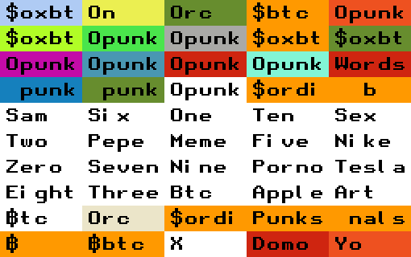

Page 2 (50-99)  
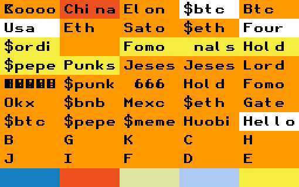

Page 3 (100-149)  
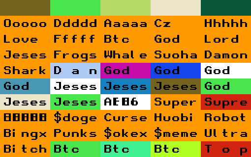

Page 4 (150-199)  
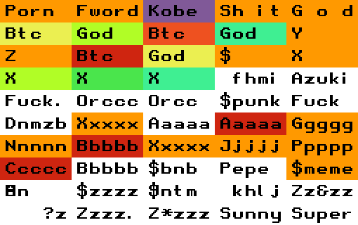

Page 5 (200-249)  
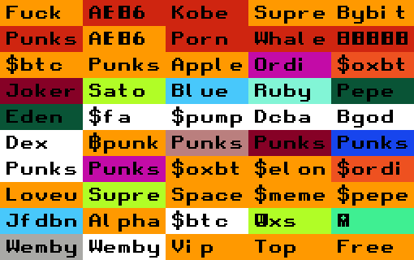

Page 6 (250-299)  
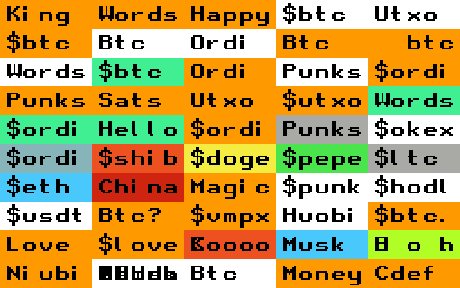

Page 7 (300-349)  
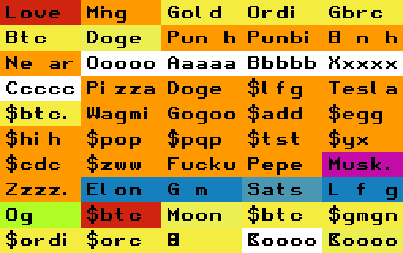

Page 8 (350-399)  
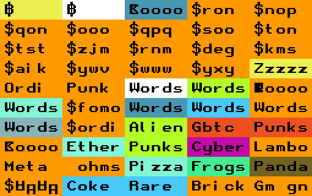

Page 9 (400-449)  
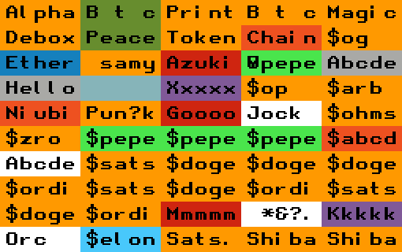

Page 10 (450-499)  
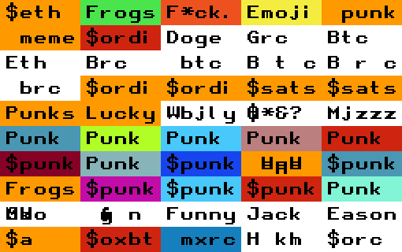

Page 11 (500-549)  
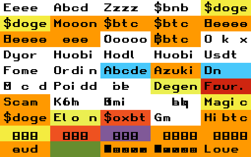

Page 12 (550-599)  
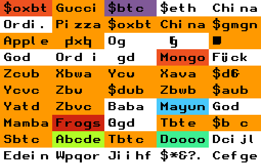

Page 13 (600-649)  
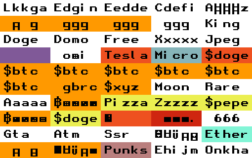

Page 14 (650-699)  
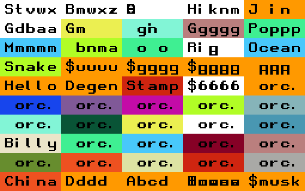

Page 15 (700-749)  
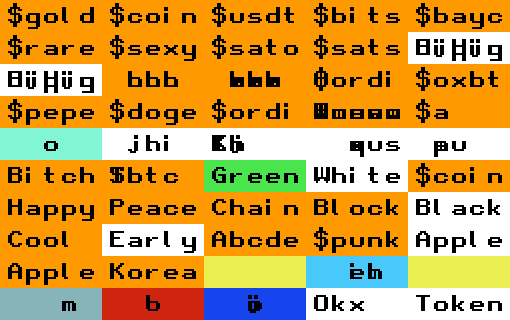

Page 16 (750-799)  
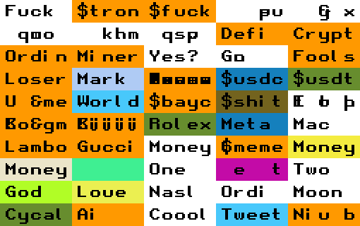

Page 15 (800-849)  
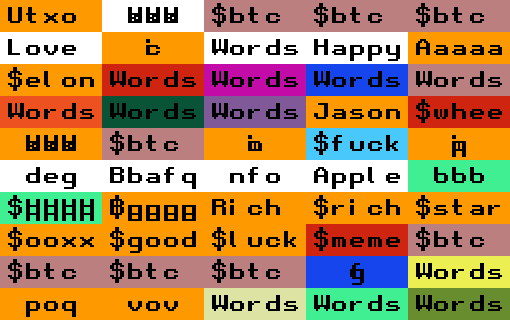

... turning the page ...

SOON!

## Questions? Comments?

Please post in the #generative-orc-721 channel
in the ordinal punks discord.
For an invite
see <https://twitter.com/OrdinalPunks/status/1620230583711576068>.

