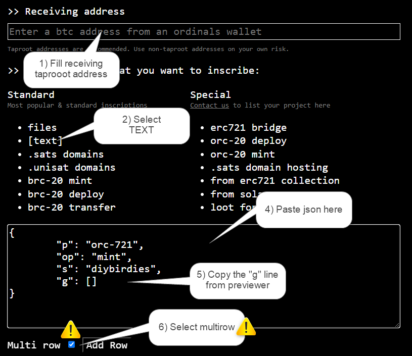

# D.I.Y. Birdies (max. 721) Quick Notes & Commentary

deploy (& spritesheet) inscribes thanks to [@TheInscriptor](https://twitter.com/TheInscriptor), public domain ("do what you want") pixel art thanks to [@TheSkullCat](https://twitter.com/TheSkullCat)


> D.I.Y. Birdies are deployed!!
>
>  -- TheInscriptor, Saturday, June 10th, 2023


Disclaimer -   **No guarantees. Use at your own risk. Here be dragons.**


## Wen deploy? Wen mint?

> Q: DIY birdies sold out ser ?

ser, d.i.y. birdies is a free mint (max. limit 721) - first-come/first-serve -  for a rough mint inscribe count search for diybirdies e.g. -> https://unisat.io/search?q=diybirdies&type=text&p=1  as of now the count is 389 results  (incl. 20+ broken mints) ... do the math!


... drum roll please ...

... the world's 1st ultra-rare never-before-seen d.i.y. birdies in 4x ...

... genesis  - no. 0 ...  is this a bot birdie?


... no. 1 ... a ultra-rare skeleton bone birdie


. no. 2 ... a white birdie with pilot helmet - ready for take-off!


... yes, you can ... d.i.y.


---

How to mint ORC-721 D.I.Y. Birdies collection (185/721 minted)
written / posted by [@TheInscriptor](https://twitter.com/TheInscriptor) (copy pasta from #generative-orc-721 discord)


Step 1 - Assemble your birdie here: <https://ordbase.github.io/generative-orc-721/diybirdies>


Step 2 - Copy the "g" array to following .json

``` json
{
    "p": "orc-721",
    "op": "mint",
    "s": "diybirdies",
    "g": []
}
```

Step 3 - Validate the json: <https://jsonlint.com>


Step 4 - Use: <https://looksordinal.com> -> IMPORTANT! - Check the image how to setup the mint

IMPORTANT! Keep the window open and focused after you make the BTC payment for inscription until all the transactions show up (you can mint more at once! Just add rows)




---


> Q: Do we need to consider the [art] layers so we dont get messed up ones like punks?

yes, for best image results use this layers / number cheat sheet -> [diybirdies/meta.csv](meta.csv)  AND the recommendation is to always preview your d.i.y. birdies here ->  <https://ordbase.github.io/generative-orc-721/diybirdies>  - happy (free) minting.


> Q: How to see the birdies after inscripted?

 about the d.i.y. birdies images ... note: all images "indexed" and confirmed listed in ->  [diybirdies/mint.csv](mint.csv)  - you can reference / see online in 1x (24x24px) and 4x (96x96px) using this link formula ...

 in 1x ->  <https://ordbase.github.io/num/11328463.png>  and ...


.. in 4x ->  <https://ordbase.github.io/num/11328463@4x.png>  ...


... change / fill in your inscribe no to see your d.i.y. birdie  (if "indexed").

the first d.i.y. birdies mints are now "indexed" (validated & confirmed) and you can see your image online in 1x or 4x ... change / fill-in the inscribe no./num in the link .. that's all.
bonus:    share the link here so we all can enjoy your d.i.y. birdie!


> Q: how can i find the broken ones to check if i didn't mint wrong?

if the mint inscribe got "indexed" and you think you got it wrong than find / check the broken mints in the diybirdies/error.txt log  - see [diybirdies/error.txt](error.txt)


More about indexing ...

... for any updates see the [diybirdies/mint.csv](mint.csv) list online and the [diybirdies/error.txt](error.txt).


## Wen market?

SOON!


##  D.I.Y. Bridie Background & Trivia

Who is the (pixel) artist?

this time the pixel art is not "hand-painted" by the punk's not dead workshop ...

... the artist is known as ...

... drum-roll please ...

TheSkullCat

... okkie ... i know ...

... here's the source used-> <https://github.com/TheSkullCat/Burds_Assets>

the pixel art license reads:

To be used with whatever your mom would approve of ...

> Permitted Use. Do what you want.
>
> Prohibited Use. No touching food with unwashed hands. No exchanging for drugs.

please respect ;-).

anyways - big thanks to TheSkullCat for sharing if ever this message will reach the artist.

ps: if anyone is on twitter maybe ping and thank the generous (pixel) artist - now getting the burds inscribed on bitcoin forever "rebranded" as d.i.y. birdies ->  <https://twitter.com/TheSkullCat>


Why Moonbirds!?

...  moonbirds collection  (on ethereum max. 10000) ... about US$300 million mint (and secondary)in the first two days ... top 2 in pixel art ... if i remember last time i checked ... officially cc0 (creative commons licensed - public domain dediction by Kevin Rose of Proof Collective - in retrospect - not on launch in april 2022 ...

... max. 10000 ... now max. 721  (AND inscribed "on-chain" on bitcoin)  ... do the math ;-).

... anyways ... back to pixel art ... the moonbirds format is in ...

... 42x42px   ... not sure if a play on 24x24px (reverse the numbers) or 42 as in the answer to everything .... anyways ... the  burds (a.k.a. birdies)  are the moonbirds redone "by hand" by TheSkullCat  in 24x24px  with some easter eggs added in for more fun ...    that's the trivia.


## Questions? Comments?

Please post in the #generative-orc-721 channel
in the ordinal punks discord.
For an invite
see <https://twitter.com/OrdinalPunks/status/1620230583711576068>.

