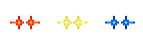
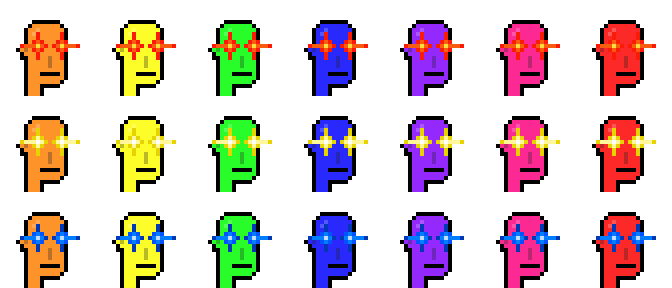
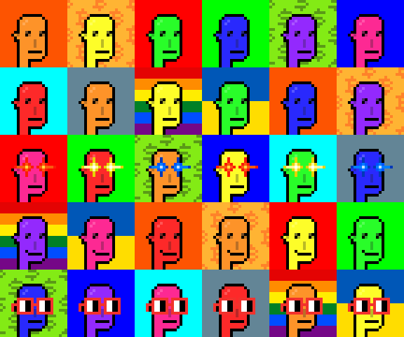
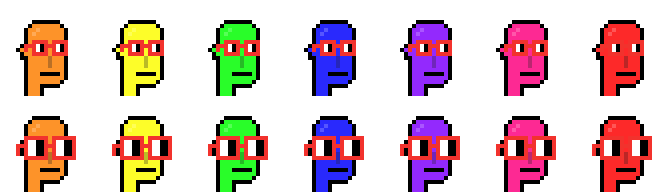

# 100 D.I.Y. Recursive Martians - Aliens Vol. 2


The idea ...

let's do the world's 1st (d.i.y) recursive generative ...
that let's you mix'n'match inscribes from more than one collection source (yes, that is recursive!) ...


## Wen mint?


To find your g(enerative) numbers in range 0-49 (50) - try the [D.I.Y. Recursive Martians - Aliens Vol. 2 Previewer »](https://ordbase.github.io/generative-orc-721/diymartians)

Or see the cheatsheet for names & categories here -> [diymartians/meta.csv](meta.csv).

For the mint inscribe text - use 

``` json
{
   "p":"orc-721",
   "op":"mint",
   "s":"diymartians",
   "g":[]
}
```

Fill-in your g(enenrative) numbers and ALWAYS validate the json format - e.g. here -> <https://jsonlint.com> 

ALWAYS preview your image for best results - YOUR NUMBERS, YOUR IMAGE.

.. IMPORTANT TIP  .... if you want a background START with background - no other way possible.

... again if you use a background  MUST be first ...  you can use NO background (than transparent).

... one more tip ..... number 8  .. is the happy alien smile!

.. tip ... if you use the hoodie (clothing)  add before laser eyes or shades or noun glasses etc.

... alpha tip ...
... only one (ultra-ultra-ultra-rare) hair attribute in the set ...
... black mohawk  - no. 7

... hard to see the (golden) jewelery ... no. 34 is the (golden) earing ...
.. no. 35 is the golden chain ...


Questions? Comments?

Please post in the #generative-orc-721 channel
in the ordinal punks discord.
For an invite
see <https://twitter.com/OrdinalPunks/status/1620230583711576068>.


## Wen deploy?

Yes, you can help ...  the deploy insribe text ...


```json
{
  "p": "orc-721",
  "op": "deploy",
  "slug": "diymartians",
  "name": "D.I.Y. Recursive Martians - Aliens Vol. 2",
  "max": 100,
  "dim": "24x24",
  "generative": [
  "0829dc471f8bb92a971dfdfb00a71c016b833c8f1d5f39dcb15aa5535d08fc15i0",
  "9482552ec759b76577b28923741eb4bfc7770cead528755bf8fa44196ae9318ci0",
  "5b8eb4a05f13fffc49f824f457fb080b67e4fdc312fbbf2f804cef59e6d5fad2i0",
  "85e0efd6cc2801ab7e1fe28e23110441348ca40481599f880c571ff4f69f066fi0",
  "7953ccb6614a41e7b4c4ed2a2b112b52feda387de92de2c1a314f03d5da41955i0",
  "2f1219924cfa01f9816581e8a39e201f15e19ab447e852ff9b43b13fa7b0c75di0",
  "e60f597ec41c50e823ea382c101dfc2f30c13a927222be3b73cedd88bd1b9237i0",
  "5ce9f89ad571e5380baa5b5ee387f08ea313421e7e54662b3899d411c39321ddi0",
  "3459b14a4fcb7bce1df0465abc711b556caba6f7b42d4f925f1ddf830be47125i0",
  "1355524a2aab576e069bac91227b0e52d227d65d84c5535377d3a0ea4e44d470i0",
  "a6b4b81f69e8c217db24f0a71954195d67ced49a819b67a4daf9f3ca7fa1b971i0",
  "83827ec13cb55a35fe3adca5acf67caf943c3bd6810f8fa893b067e8015c8f19i0",
  "5b1e638c050318bec23f17b8b7758ccf13945e422516da6c722c67ae5ed4e26di0",
  "5dcf96b13e5762d5a288d8bee36deb933fe192a55475199fe9a39ae29dd16853i0",
  "5760ce05009e94a750a7245cac994fa9ffd388eadc757929ac17737811455429i0",
  "0bd902941392ea138adb7db30cecdf5bc09a92c80e3e1bc3ecdf3c2d0abf6631i0",
  "7c2fd41b52624ddb1ba11fe1c6d95475f2e42c4b53d6aaf6a16a09064acebe38i0",
  "0f473c9dcd14e3f43a6599b038d810eac16bc6394edcfcf6b32f8df992ab6791i0",
  "d32c50c23693a028e2381d6f756746a9ff684f2028edf694ab7b1b6cde78e2cdi0",
  "d61fc2a89ecc6ae65cf91cdfac9edc37fd60c38621dac211f3a70891ef79b69ai0",
  "680e2ee8cad86aa174b4f3373d733370c9a6fc4230b9708d520a0f6bcb8e72a6i0",
  "56d3f4f661b2b4a9fc17755171d7cf4da74e570614b6b45de0cc87a809c3eb3ci0",
  "fe4321178bd841e52fdeb72ce4456c5b7596c0d611b19da15ba75ec63b5314cai0",
  "eddc1242f0fd290e130332e046897ad41dce1e7e112df48ecf2168e43172d383i0",
  "a2110fb4afaa29bc70bcfac445f750ecb5e81777e8d080be2d2b07eb030ba0ffi0",
  "c1277df4b986067b2a3f006d717b7f6d042896840c8b592e5a8b9ff22444b08fi0",
  "722dfdc90a67ff7eb892d13393a8a5b360b8a109f3d809600919684a600ff60ei0",
  "a0d11e78978a9dd5f1d891b71f06bd2d411c08372eba1f23e8b0722474388130i0",
  "2c2d812754b9374ffb699173da7f6d476af138a99906b66b8453cc4343305167i0",
  "964c52312f1db9025695b181d5f631292d29bec63ff9587138a589cb5ff8c26di0",
  "545fd4d45d2f6d732d48accc082f72b67a00d19f88517320f814bf1fe827c816i0",
  "72fe7ebda802852f499dca865ec22ac43eacfcf4796d761969ae8358791e943ci0",
  "4db2e931b5cd489d8007d111d20ab97d84161b84c8f7ff3038e1afe79567b9afi0",
  "4869c9bb7cf23e68ad94da5b1e9de1feff1ebdcaf9a08fccca5f1887dd40e239i0",
  "06136a5b4fb585069ef6265a0fde3baf67ee914b9f784d2c951f3a8187800d54i0",
  "8043604c7c96a5a43a97e251b246102ca40c0203431ff21bd26f23330dfa554ci0",
  "92e7f48454546718f98103d7464d954033adbee21855f06584be06faa3e291ddi0",
  "a01012b213ed425c5d4038bc36016f19f4f342ca052ff9bf6971672164e1a402i0",
  "87d89d290ebde5d5b7aa75b4c8d0359515e25ea1542bc0646dc3f5b0b2fc55fdi0",
  "aab67a4269ca0bda649fe341bd88c862aba2e9bf6e0826b9dfa5c4ba8fe62c2di0",
  "189b02ffc8aac68a45102e9837a1ca92e422bf5544d9011a863626cf6b0abeeai0",
  "43e93e43f2dac75b141baaa5b08df440e0b6ec5755577a9554a7af6540447bb7i0",
  "39d774f7d7514371c88bc4f939346f6b23000c9892ac4ae8ea36c76694e3b842i0",
  "b268b2acccd6b04680c2aa3130863ffbaa450f6870f100af678428cd07212ef6i0",
  "ac810c9098681e100964166b7510d1ac371c147861b0ae2a862da3a8b8256037i0",
  "4b9f880df07b072a4147a62acdd0881d024d14da6d84174db9b5ac555b71b346i0",
  "014ad6ed6297bc4ed624b2856e036c6bde115d51eb7200b14e3b3413ad53db08i0",
  "e139b5b0649186772cbf044bb8d3c5e43b77e3cf0472008ce2aaf52966c921eci0",
  "6eb271ad3fdd15cc2ec34dda462e71aaa8a7ef7e306cfd189931ef37216a9c60i0",
  "47cb34f1d73371df0b27ca0a259927fa80e2b2d9ee0e1d487fca5c9029b67b49i0"
]}
```


### Step 1:  24×24px .PNG Inscribes - New Aliens, Laser Eyes & Backgrounds To "Recurse"

Help with the 24×24px .PNG inscribes ...      IMPORTANT! PLEASE ONLY INSCRIBE 24x24px .PNGs in 1x .. NO 4x -  the 4x is only for documentation in the readme page.


#### 7 Martians in 24×24px in .PNG   - DONE!

orange ->   <- (204 bytes)   [inscribe №12225771](https://www.ord.io/12225771)  by  [@612crypto_eth](https://twitter.com/612crypto_eth) - thank you!<br>
gold       ->     <-  (204 bytes)  [inscribe №12225872](https://www.ord.io/12225872)  by [@612crypto_eth](https://twitter.com/612crypto_eth) - thank you!<br>
cyber green  ->    <-  (207 bytes)  [inscribe №12225773](https://www.ord.io/12225773) by  [@612crypto_eth](https://twitter.com/612crypto_eth) - thank you!<br>
deep blue   ->     <- (207 bytes)    [inscribe №12225772](https://www.ord.io/12225772) by  [@612crypto_eth](https://twitter.com/612crypto_eth) - thank you!<br>
midnight   ->      <- (204 bytes)  [inscribe №12225841](https://www.ord.io/12225841) by [@612crypto_eth](https://twitter.com/612crypto_eth) - thank you!<br>
magenta    ->      <- (204 bytes)   [inscribe №12225843](https://www.ord.io/12225843)    by  [@612crypto_eth](https://twitter.com/612crypto_eth) - thank you!<br>
mars red ->   <- (204 bytes)   [inscribe №12225816](https://www.ord.io/12225816) by [@612crypto_eth](https://twitter.com/612crypto_eth) - thank you!


in 4x  (only for documentation - DO NOT INSCRIBE)<br>


#### 3 Laser Eyes in 24×24px in .PNG   - DONE!

laser eyes ->   <- (143 bytes)  [inscribe №12359718](https://www.ord.io/12359718)  by  [@612crypto_eth](https://twitter.com/612crypto_eth) - thank you!<br>
laser eyes (gold) ->    <- (143 bytes)  [inscribe №12359739](https://www.ord.io/12359739)  by  [@612crypto_eth](https://twitter.com/612crypto_eth) - thank you!<br>
laser eyes (blue) ->    <- (208 bytes)  [inscribe №12359716](https://www.ord.io/12359716) by  [@612crypto_eth](https://twitter.com/612crypto_eth) - thank you!


in 4x  (only for documentation - DO NOT INSCRIBE)<br>


and a sampling of Martians w/ Laser Eyes in 4x  (only for documentation - DO NOT INSCRIBE)<br>



#### 10 Backgrounds in 24×24px in .PNG  - DONE!


bitcoin orange ->    <- (136 bytes)   [inscribe №12723302](https://www.ord.io/12723302)  by  [@612crypto_eth](https://twitter.com/612crypto_eth) - thank you!<br>
bitcoin pattern ->   <- (183 bytes)  [inscribe №12723301](https://www.ord.io/12723301)  by  [@612crypto_eth](https://twitter.com/612crypto_eth) - thank you!<br>
red             ->    <- (136 bytes)  [inscribe №12723296](https://www.ord.io/12723296)  by  [@612crypto_eth](https://twitter.com/612crypto_eth) - thank you!<br>
green           ->   <- (136 bytes)  [inscribe №12723304](https://www.ord.io/12723304)  by  [@612crypto_eth](https://twitter.com/612crypto_eth) - thank you!<br>
greenback (dollar) pattern  ->   <-  (186 bytes)  [inscribe №12723295](https://www.ord.io/12723295)  by  [@612crypto_eth](https://twitter.com/612crypto_eth) - thank you!<br>
blue  ->    <- (136 bytes)  [inscribe №12723297](https://www.ord.io/12723297)  by  [@612crypto_eth](https://twitter.com/612crypto_eth) - thank you!<br>
aqua  ->    <- (136 bytes)  [inscribe №12723293](https://www.ord.io/12723293)  by  [@612crypto_eth](https://twitter.com/612crypto_eth) - thank you!<br>
classic ->   <- (136 bytes)  [inscribe №12723303](https://www.ord.io/12723303)  by  [@612crypto_eth](https://twitter.com/612crypto_eth) - thank you!<br>
rainbow  ->    <- (124 bytes)  [inscribe №12723299](https://www.ord.io/12723299)  by  [@612crypto_eth](https://twitter.com/612crypto_eth) - thank you!<br>
ukraine  ->    <- (95 bytes)  [inscribe №12723298](https://www.ord.io/12723298)  by  [@612crypto_eth](https://twitter.com/612crypto_eth) - thank you!


in 4x  (only for documentation - DO NOT INSCRIBE)<br>


and a sampling of  Martians w/ Backgrounds in 4x (only for documentation - DO NOT INSCRIBE)<br>



#### Bonus - 1 Happy Smile in 24×24px in .PNG  - DONE!

smile ->   <- (90 bytes)   [inscribe №12360772](https://www.ord.io/12360772) by  [@612crypto_eth](https://twitter.com/612crypto_eth) - thank you!


in 4x (only for documentation - DO NOT INSCRIBE)<br>


and a sampling of  Martians w/ Smile in 4x (only for documentation - DO NOT INSCRIBE)<br>


#### Bonus -  2 Noun Glasses in 24×24px in .PNG  - DONE!

noun glasses      ->    <- (189 bytes)   [inscribe №12359717](https://www.ord.io/12359717) by  [@612crypto_eth](https://twitter.com/612crypto_eth) - thank you!<br>
noun glasses xl   ->    <- (196 bytes)   [inscribe №12359733](https://www.ord.io/12359733)  by  [@612crypto_eth](https://twitter.com/612crypto_eth) - thank you!


in 4x (only for documentation - DO NOT INSCRIBE)<br>


and a sampling of Martians w/ Noun Glasses in 4x (only for documentation - DO NOT INSCRIBE)<br>



###  Step 2:   The Deploy Inscribe - LFG!

SOON!    First with your help let's complete step 1 and than ready to deploy in minutes.


###  Frequently Asked Questions (F.A.Q.) and Answers

> Q: Bro, I can carve parts. What should I do？

See the 24×24px .PNG Inscribes  with the label
"HELP - PLEASE, INSCRIBE!"  above  - pick any .PNG ( each about 200 bytes) and inscribe
and please post in the #generative-orc-721 channel
in the ordinal punks discord   to avoid double sats spending ;-) - double inscribes of 24x24 .PNGs.

If all 10 backgrounds .PNGs and 1,2 or 3 laser eyes .. and the bonus happy smile ... and optinally the noun glasses ...
are inscribed than all is set for step 2 ... Wen deploy?


> Q: Why u say "Let's do the world's 1st (d.i.y) recursive generative"
> why is it [100 D.I.Y. Recursive Martians - Aliens Vol. 2] the 1st?

... the world's 1st (d.i.y.) recursive generative is [100 d.i.y.(recursvie) apes](../diyapes) ...<br>
... now why is the upcoming "100 D.I.Y. (Recursive) Martians - Aliens Vol. 2"  the world's 1st (d.i.y) recursive generative ...<br>
... it is the the world's 1st (d.i.y) true recursive generative mix-n-match collection ...<br>
... you see? ...<br>
...  all recursive attributes to generate  100 d.i.y.(recursvie) apes are sourced from .... ??? ...<br>
.... yes, all recursive attributes are single-sourced from recursive punks  inscribed by a single bro - see <https://ordiscan.com/address/bc1p2wrnw6gkyapz67s7ew422z5j9wt442t48day79pe5lv275at5phqlpn9cn> ...<br>
.... how recursive is that?! ...<br>
... all recursive attributes to generate  100 d.i.y.(recursvie) martians - aliens vol. 2  are sourced from .... ???? ...<br>
... many sources ... many inscribers ... mix-n-match ... yes, that's recursive! ... ( and not yet another inscribed "recursive" .HTML image carousel (anno 2023) that lets you browse other people's ordinals)...<br>
... help to  make it happen today!  inscribe yourself in history and own the (bitcoin) orange 24x24px square
or pattern (background). yes, you can!


## Questions? Comments?

Please post in the #generative-orc-721 channel
in the ordinal punks discord.
For an invite
see <https://twitter.com/OrdinalPunks/status/1620230583711576068>.


