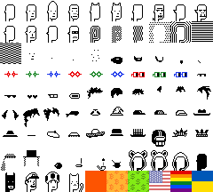

# 100 D.I.Y. Maxi Biz (Punks)


To find your g(enerative) numbers in range 0-89 (90) - try the [D.I.Y. Maxi Biz (Punks) Previewer »](https://ordbase.github.io/generative-orc-721/diymaxibiz)


## Wen deploy?


Here's everything to make it happen - yes, you can help inscribe!


### Step 1:   Inscribe spritesheet.png (<4kb)




### Step 2:  Inscribe the collection deploy text

Note:  Fill-in the inscription id for the inscribed spritesheet.png above.

```
og deploy diymaxibiz
name: D.I.Y. Maxi Biz (Punks)
max: 100
dim: 24x24
<inscription_id_here>
```


That's it. Yes, you can.


## Samples


`og mint diymaxibiz 85 9 28 29 65 34`


`og mint diymaxibiz 84 9 78 73 35`


`og mint diymaxibiz 86 12 25 34`


`og mint diymaxibiz 1 22 44 73 34`


`og mint diymaxibiz 84 3 64 34`


`og mint diymaxibiz 87 1 66 27 74 34`


`og mint diymaxibiz 84 81 34`


## Questions? Comments?

Please post in the #generative-orc-721 channel
in the ordinal punks discord.
For an invite
see <https://twitter.com/OrdinalPunks/status/1620230583711576068>.
