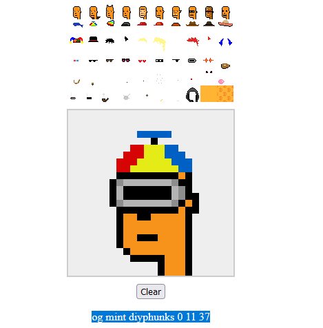
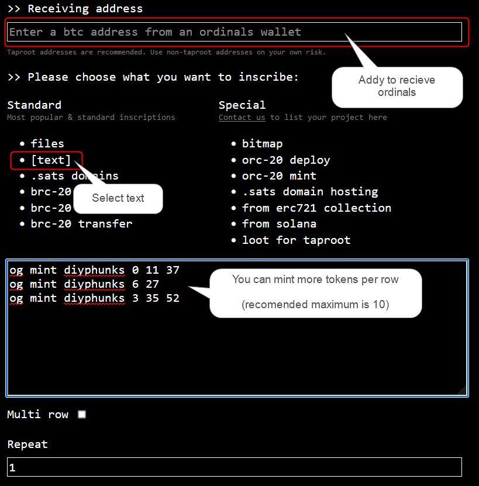

# 100 D.I.Y. (Left-Looking) Phunks -  Orange-Pilled Theme

The idea ...

let's do the world's 1st d.i.y. generative ... left-looking phunks ...

... and the world's 1st ordgen / ORC-721 collection using the new standard text format for deploy & mint ...

Try the [D.I.Y. Phunks (Image) Previewer »](https://ordbase.github.io/generative-orc-721/diyphunks)


## Wen mint?

deploy (& spritesheet) inscribes thanks to [@AlteredOracle](https://twitter.com/AlteredOracle)

Disclaimer -   **No guarantees. Use at your own risk. Here be dragons.**


### How to mint 100 D.I.Y. Phunks collection

(copy-n-paste from announcement in [Ordinal Phunks](https://twitter.com/OrdinalPhunksV0) discord)
by [@TheInscriptor](https://twitter.com/TheInscriptor)

Step 1 - Assemble your Phunk here: https://ordbase.github.io/generative-orc-721/diyphunks

Step 2 - Copy the generated string, example:

    og mint diyphunks 0 11 37

Step 3 -  Use: https://looksordinal.com/index.html (or any preferred inscription service) to mint the token


IMPORTANT!  Keep the window open and focused after you make
the BTC payment for inscription until all the transactions
show up (you can mint more at once, recomended max is 10)

Feel free to check #random (General) channel
in the ordinal phunks discord for any questions.

Example:






<!-->

## D.I.Y. PHUNKS (MAX. 99) NEED YOUR HELP

PHREE THE PHUNKS!

... let's kick-off 99 D.I.Y. (Left-Looking) Phunks this weekend ...

if anyone is interested in the upcoming free mint (first-come / first-serve),
please join the Ordinal Phunks discord ....
 for now find news & updates  in the #random (General) channel

Note: this is a world's 1st ORC-721 collection ... first with the new og standard text protocol ...
making minting easier (goodbye json, goodbye quotes (`"""`), goodbye commas (`,,,,`), goodbye objects (`{}`)
and so on (and less bytes saving sats).

Yes, you can help! Looking for inscribe sponsors to get started minting this weekend ...
for news & updates join  the Ordinal Phunks discord ..

Ordinal Phunks - what!? For more and discord invite see [**Ordinal Phunks »**](https://twitter.com/OrdinalPhunksV0)

Yes,  do not fade the Ordinal Phunks ... Ordinal Phunks are not going away ... and now get 99 D.I.Y. (Left-Looking) Phunks frens  ...
join us to make it happen.


PS:  Try the [D.I.Y. Phunks (Image) Previewer »](https://ordbase.github.io/generative-orc-721/diyphunks)


## Wen deploy?

Here's everything to make it happen - yes, you can help inscribe!


### Step 1:   Inscribe spritesheet.png (~3kb)


### Step 2:  Inscribe the collection deploy text

Note:  Fill-in the inscription id for the inscribed spritesheet.png above.

```
og deploy diyphunks
name: D.I.Y. Phunks
max: 99
dim: 24x24
<inscription_id_here>
```


That's it. Yes, you can.
-->


## Questions? Comments?

Please post in the #random (General) channel
in the ordinal phunks discord.
For an invite
see <https://twitter.com/OrdinalPhunksV0>.

